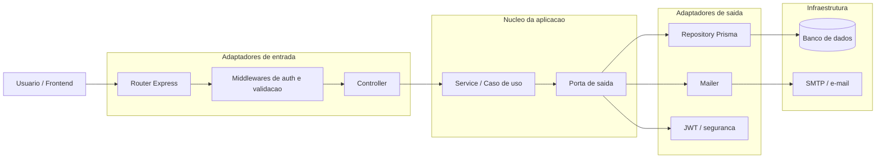
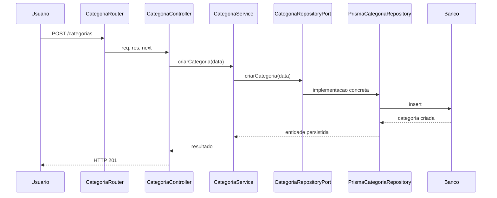

# Arquitetura Hexagonal no NossoSaldo

## Objetivo deste documento

Este material explica:

- o que e arquitetura hexagonal;
- como esse modelo aparece hoje no backend do NossoSaldo;
- onde a implementacao ja segue bem o padrao;
- onde a aplicacao ainda esta em um modelo hibrido entre camadas tradicionais e hexagonal.

Este documento complementa o overview geral em [arquitetura.md](C:\Projetos\NossoSaldo\api\src\docs\arquitetura.md).

## Resumo rapido

Arquitetura hexagonal, tambem chamada de `Ports and Adapters`, organiza o sistema para que a regra de negocio fique no centro, isolada de detalhes externos como:

- HTTP;
- banco de dados;
- JWT;
- envio de e-mail;
- frameworks;
- integracoes.

A ideia principal e:

- o dominio e os casos de uso nao devem depender de Express, Prisma ou SMTP;
- o mundo externo conversa com a aplicacao por adaptadores;
- os contratos entre aplicacao e infraestrutura sao definidos por portas.

No NossoSaldo, esse desenho aparece principalmente assim:

- `routers` e `controllers` atuam como adaptadores de entrada;
- `services` concentram os casos de uso;
- `ports/outbound` definem contratos para dependencias externas;
- `repositories` implementam esses contratos usando Prisma;
- `lib/mailer.ts` e componentes de seguranca funcionam como infraestrutura.

## Mapa mental do padrao

## Como ler isso dentro do projeto

### 1. Adaptadores de entrada

Sao os componentes que recebem comandos do mundo externo e traduzem isso para a aplicacao.

No projeto, os principais sao:

- `api/src/routers`
- `api/src/controllers`
- `api/src/routers/middlewares`
- `api/src/schemas`

Exemplo com categoria:

- o router define a rota HTTP em [categoriaRouter.ts](C:\Projetos\NossoSaldo\api\src\routers\categoria\categoriaRouter.ts);
- o controller traduz `req/res` para chamada de aplicacao em [categoriaController.ts](C:\Projetos\NossoSaldo\api\src\controllers\categoria\categoriaController.ts);
- a validacao do payload acontece via schema antes do caso de uso;
- o service executa a acao real.

### 2. Nucleo da aplicacao

Aqui vive a regra de negocio. No NossoSaldo, isso esta principalmente em:

- `api/src/services`

Exemplo:

- [categoriaService.ts](C:\Projetos\NossoSaldo\api\src\services\categoria\categoriaService.ts)
- [usuarioService.ts](C:\Projetos\NossoSaldo\api\src\services\usuario\usuarioService.ts)
- [gastoService.ts](C:\Projetos\NossoSaldo\api\src\services\gasto\gastoService.ts)
- [faturaCartaoService.ts](C:\Projetos\NossoSaldo\api\src\services\faturaCartao\faturaCartaoService.ts)

Esses services deveriam conhecer:

- regras;
- fluxos;
- restricoes;
- contratos de dependencias.

E idealmente nao deveriam conhecer:

- Express;
- Prisma;
- detalhes de SQL;
- detalhes de transporte HTTP.

### 3. Portas

As portas sao contratos. No backend atual, o projeto usa principalmente portas de saida em:

- `api/src/ports/outbound`

Exemplo real:

- [categoriaRepositoryPort.ts](C:\Projetos\NossoSaldo\api\src\ports\outbound\categoriaRepositoryPort.ts)
- [usuarioRepositoryPort.ts](C:\Projetos\NossoSaldo\api\src\ports\outbound\usuarioRepositoryPort.ts)
- [gastoRepositoryPort.ts](C:\Projetos\NossoSaldo\api\src\ports\outbound\gastoRepositoryPort.ts)
- [faturaCartaoRepositoryPort.ts](C:\Projetos\NossoSaldo\api\src\ports\outbound\faturaCartaoRepositoryPort.ts)

Essas interfaces fazem o service depender de um contrato, e nao diretamente de Prisma.

### 4. Adaptadores de saida

Sao implementacoes concretas das portas.

No projeto:

- `api/src/repositories`

Exemplo:

- [categoriaRepository.ts](C:\Projetos\NossoSaldo\api\src\repositories\categoria\categoriaRepository.ts)
- [usuarioRepository.ts](C:\Projetos\NossoSaldo\api\src\repositories\usuario\usuarioRepository.ts)
- [gastoRepository.ts](C:\Projetos\NossoSaldo\api\src\repositories\gasto\gastoRepository.ts)

Esses adapters sabem conversar com:

- Prisma;
- banco de dados;
- transacoes;
- detalhes de persistencia;
- mapeamento de erro de infraestrutura para erro de aplicacao.

## Exemplo completo: fluxo de Categoria

O fluxo de categoria e um bom exemplo simples da arquitetura atual.

Arquivos envolvidos:

- entrada HTTP: [categoriaRouter.ts](C:\Projetos\NossoSaldo\api\src\routers\categoria\categoriaRouter.ts)
- controller: [categoriaController.ts](C:\Projetos\NossoSaldo\api\src\controllers\categoria\categoriaController.ts)
- caso de uso: [categoriaService.ts](C:\Projetos\NossoSaldo\api\src\services\categoria\categoriaService.ts)
- contrato: [categoriaRepositoryPort.ts](C:\Projetos\NossoSaldo\api\src\ports\outbound\categoriaRepositoryPort.ts)
- adapter de saida: [categoriaRepository.ts](C:\Projetos\NossoSaldo\api\src\repositories\categoria\categoriaRepository.ts)

## Onde a arquitetura hexagonal ja aparece bem

### Separacao entre entrada, aplicacao e persistencia

Isso esta bem claro em varios modulos:

- `router -> controller -> service -> repository`

Mesmo quando o nome usado e "camadas", a dependencia principal continua proxima do estilo hexagonal.

### Uso de interfaces para infraestrutura

Os services mais evoluidos recebem contratos tipados no construtor. Isso ajuda em:

- testes unitarios;
- troca de implementacao;
- reducao de acoplamento com Prisma.

Exemplo:

- [CategoriaService](C:\Projetos\NossoSaldo\api\src\services\categoria\categoriaService.ts)
- [UsuarioService](C:\Projetos\NossoSaldo\api\src\services\usuario\usuarioService.ts)
- [FaturaCartaoService](C:\Projetos\NossoSaldo\api\src\services\faturaCartao\faturaCartaoService.ts)

### Repositories como adaptadores concretos

Os repositories encapsulam acesso a dados e mapeamento de erros, o que evita espalhar Prisma por controllers e services.

### Testes mais baratos no nucleo

Como os services dependem de contratos, boa parte dos testes consegue mockar repositories sem precisar subir banco real.

## Onde a aplicacao ainda e um modelo hibrido

O projeto se aproxima de hexagonal, mas ainda nao esta 100% no formato mais rigoroso.

### 1. Composition root distribuido

Em varios services, a instancia concreta e montada no mesmo arquivo:

- o service importa o repository concreto;
- depois exporta um singleton pronto.

Exemplo em [categoriaService.ts](C:\Projetos\NossoSaldo\api\src\services\categoria\categoriaService.ts):

- a classe depende de `CategoriaRepositoryPort`;
- mas o arquivo tambem importa `categoriaRepository` concreto e cria `export const categoriaService = new CategoriaService(categoriaRepository)`.

Isso funciona bem, mas mistura:

- definicao do caso de uso;
- composicao da dependencia concreta.

Num hexagonal mais puro, isso costuma ir para um modulo de montagem da aplicacao.

### 2. Services ainda conversam entre si diretamente

Alguns services chamam outros services concretos, por exemplo:

- [relatorioService.ts](C:\Projetos\NossoSaldo\api\src\services\relatorio\relatorioService.ts)
- [insightsService.ts](C:\Projetos\NossoSaldo\api\src\services\insights\insightsService.ts)

Isso nao e necessariamente errado, mas cria acoplamento entre casos de uso. Em um desenho mais estrito, parte disso poderia virar:

- um caso de uso orquestrador;
- ou uma porta interna mais explicita.

### 3. Ausencia de portas de entrada explicitas

Hoje a entrada da aplicacao passa por controllers e services, mas nao existe uma camada formal de `inbound ports` ou `use cases` nomeados como contratos.

Na pratica, o controller chama o service diretamente.

Isso e comum em projetos Node/Express e continua valido, mas e menos explicito do que um hexagonal formal.

### 4. Regras tecnicas misturadas com regras de dominio

Partes de autenticacao, validacao e erro ainda aparecem espalhadas entre:

- middlewares;
- services;
- secure;
- repositories.

Nao chega a quebrar o modelo, mas mostra que o sistema esta entre:

- arquitetura em camadas;
- arquitetura hexagonal pragmatica.

## Regra de dependencia desejada

Uma forma simples de avaliar se estamos seguindo bem o padrao e perguntar:

"A regra de negocio conseguiria continuar existindo se eu trocasse Express e Prisma?"

Hoje a resposta no NossoSaldo e:

- em varios services: `quase sim`;
- em controllers e repositories: `nao precisa`, porque eles ja sao adaptadores;
- no projeto como um todo: `sim, com pequenos ajustes de composicao e contratos`.

## O que cada pasta representa no modelo

| Pasta | Papel na hexagonal |
| --- | --- |
| `routers/` | adaptadores de entrada HTTP |
| `controllers/` | tradutores entre HTTP e casos de uso |
| `schemas/` | validacao de contrato de entrada |
| `services/` | nucleo da aplicacao e casos de uso |
| `ports/outbound/` | portas de saida |
| `repositories/` | adaptadores de saida para persistencia |
| `lib/` | infraestrutura compartilhada |
| `secure/` | infraestrutura de autenticacao/autorizacao |
| `docs/` | documentacao tecnica |

## Beneficios praticos desse desenho no NossoSaldo

- facilita testar regra de negocio sem depender de banco real;
- reduz impacto de trocar detalhes de persistencia;
- ajuda a manter controllers finos;
- concentra regras de negocio em services;
- melhora legibilidade por modulo;
- deixa as integracoes externas mais controladas.

## Limites atuais

- o nome `service` concentra tanto caso de uso quanto parte da orquestracao;
- algumas dependencias concretas ainda sao importadas nos proprios modulos de aplicacao;
- faltam contratos mais explicitos para entradas complexas;
- o frontend nao segue o mesmo padrao arquitetural, entao a hexagonal esta essencialmente no backend.

## Como evoluir sem reescrever tudo

Uma evolucao pragmatica poderia seguir esta ordem:

1. Criar um `composition root` para montar services e repositories fora dos arquivos de caso de uso.
2. Padronizar services para depender apenas de portas e tipos de dominio.
3. Introduzir `use cases` nomeados para fluxos mais importantes, como `PagarGasto`, `ReabrirFatura` e `GerarInsights`.
4. Reduzir dependencias service-to-service quando houver orquestracao excessiva.
5. Formalizar melhor as fronteiras de entrada e saida em modulos mais complexos.

## Conclusao

O backend do NossoSaldo nao esta em uma hexagonal "academicamente pura", mas ja aplica os fundamentos mais importantes do padrao:

- nucleo com regra de negocio;
- dependencias externas atras de contratos;
- adaptadores de entrada e saida bem identificaveis.

O melhor jeito de descrever a situacao atual e:

`uma arquitetura em camadas com forte inclinacao para hexagonal`.

Isso e positivo porque entrega os beneficios principais do modelo sem exigir uma complexidade desnecessaria para o tamanho atual do sistema.
