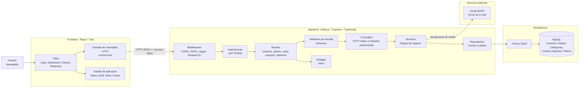
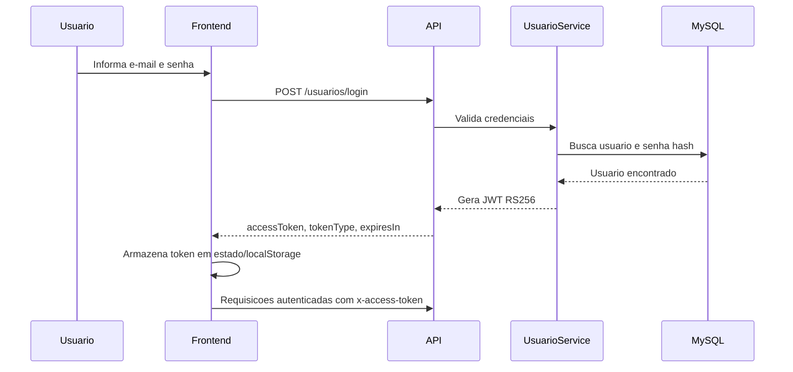
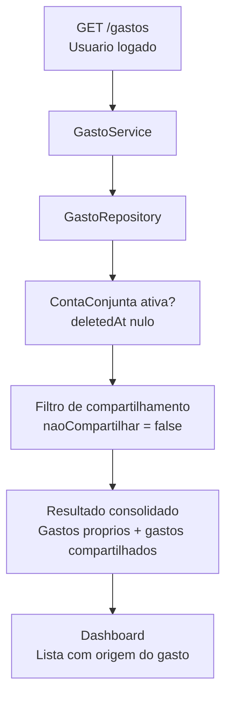
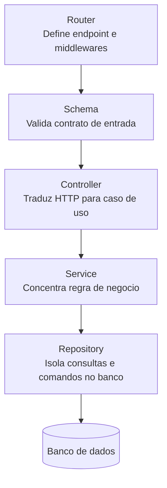

# Arquitetura do NossoSaldo

## Visao Geral

## Fluxo de Autenticacao

## Fluxo de Gastos Compartilhados

## Padrao de Camadas

## Componentes Principais

| Camada | Responsabilidade | Exemplos |
| --- | --- | --- |
| Frontend | Interface, navegacao local, chamadas HTTP e exibicao dos dados | Login, Dashboard, relatorios, listagem de gastos |
| Routers | Exporem endpoints e aplicarem middlewares | `usuarioRouter`, `gastoRouter`, `relatorioRouter` |
| Controllers | Montarem resposta HTTP padronizada | `sendSuccess`, status codes, payloads |
| Services | Aplicarem regras de negocio | login, edicao de gasto, compartilhamento, relatorios |
| Repositories | Consultarem e persistirem dados | Prisma, queries SQL, transacoes |
| Secure | Autenticacao e autorizacao | JWT RS256, token expirado, assinatura invalida |
| Lib | Infraestrutura de apoio | logger, mailer |
| Banco | Estado persistente da aplicacao | usuarios, gastos, categorias, conta conjunta, tokens |

## Pontos Fortes da Arquitetura

- Separacao clara entre HTTP, regra de negocio e persistencia.
- Autenticacao baseada em JWT assinado com RS256.
- Soft delete em entidades sensiveis, preservando historico.
- Respostas HTTP padronizadas com `sendSuccess`.
- Documentacao Swagger exposta em `/docs`.
- Logger estruturado com request ID, facilitando rastreabilidade.
- Relatorios tratados como modulo separado, o que facilita evolucao.

## Melhorias Futuras Recomendadas

- Centralizar a instancia do Prisma para evitar multiplas conexoes.
- Padronizar todos os repositories para evitar mistura excessiva entre Prisma ORM e SQL raw.
- Criar um modulo de observabilidade com niveis de log, mascaramento de dados sensiveis e correlacao por usuario.
- Adicionar testes end-to-end cobrindo login, gastos individuais, gastos compartilhados e relatorios.
- Criar pipeline CI com lint, testes, build e validacao de migrations.
